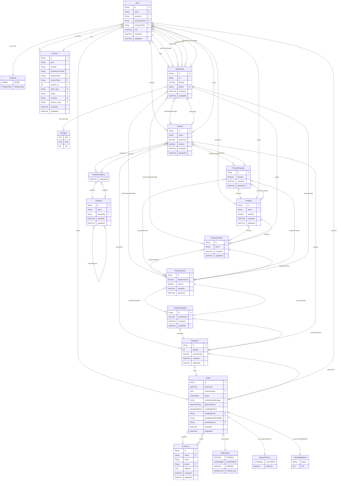

```mermaid
erDiagram

        UserRole {
            ADMIN ADMIN
PRODUCER PRODUCER
        }
    


        FileType {
            JPG JPG
PNG PNG
GIF GIF
        }
    


        OrderStatus {
            PENDING PENDING
CONFIRMED CONFIRMED
SHIPPED SHIPPED
CANCELLED CANCELLED
        }
    


        ApprovalPolicy {
            AUTOMATIC AUTOMATIC
MANUAL MANUAL
        }
    


        HandlingMethod {
            EMAIL EMAIL
API API
        }
    
  "User" {
    String id "🗝️"
    String email "❓"
    String password "❓"
    String companyName "❓"
    String companyData "❓"
    UserRole role 
    DateTime createdAt 
    DateTime updatedAt 
    }
  

  "Account" {
    String id "🗝️"
    String type 
    String provider 
    String providerAccountId 
    String refreshToken "❓"
    String accessToken "❓"
    Int expires_at "❓"
    String token_type "❓"
    String scope "❓"
    String id_token "❓"
    String session_state "❓"
    DateTime createdAt 
    DateTime updatedAt 
    }
  

  "Multimedia" {
    String id "🗝️"
    String url 
    FileType fileType 
    String altText "❓"
    DateTime createdAt 
    DateTime updatedAt 
    }
  

  "Property" {
    String id "🗝️"
    String name 
    Boolean isGlobal 
    DateTime createdAt 
    DateTime updatedAt 
    }
  

  "PropertyVariant" {
    String id "🗝️"
    String name 
    DateTime createdAt 
    DateTime updatedAt 
    }
  

  "Product" {
    String id "🗝️"
    String name 
    Decimal basePrice 
    Boolean isActive 
    DateTime createdAt 
    DateTime updatedAt 
    }
  

  "Category" {
    String id "🗝️"
    String name 
    String description "❓"
    DateTime createdAt 
    DateTime updatedAt 
    }
  

  "ProductCategory" {
    DateTime assignedAt 
    }
  

  "ProductProperty" {
    String id "🗝️"
    Boolean isActive 
    DateTime createdAt 
    DateTime updatedAt 
    }
  

  "ProductVariant" {
    String id "🗝️"
    Decimal additionalCost 
    Boolean isActive 
    DateTime createdAt 
    DateTime updatedAt 
    }
  

  "Customer" {
    String id "🗝️"
    String name "❓"
    String email 
    String phone "❓"
    Json address "❓"
    DateTime createdAt 
    DateTime updatedAt 
    }
  

  "Order" {
    String id "🗝️"
    DateTime orderDate 
    Json customerData "❓"
    OrderStatus status 
    String confirmationMessage "❓"
    ApprovalPolicy approvalPolicy 
    HandlingMethod handlingMethod 
    String handlingEmail "❓"
    String handlingEmailTemplate "❓"
    String handlingApiUrl "❓"
    DateTime createdAt 
    DateTime updatedAt 
    }
  

  "OrderItem" {
    String id "🗝️"
    Int quantity 
    Decimal priceAtOrder 
    DateTime createdAt 
    DateTime updatedAt 
    }
  

  "OrderItemVariant" {
    String id "🗝️"
    Decimal costAtOrder 
    DateTime createdAt 
    DateTime updatedAt 
    }
  
    "User" o|--|o "Multimedia" : "logo"
    "User" o|--|o "Multimedia" : "startScreenImage"
    "User" o|--|| "UserRole" : "enum:role"
    "User" o{--}o "Account" : "accounts"
    "User" o{--}o "Product" : "products"
    "User" o{--}o "Property" : "properties"
    "User" o{--}o "Multimedia" : "multimedia"
    "User" o{--}o "Order" : "orders"
    "Account" o|--|| "User" : "user"
    "Multimedia" o|--|| "FileType" : "enum:fileType"
    "Multimedia" o|--|| "User" : "owner"
    "Multimedia" o{--}o "User" : "userLogos"
    "Multimedia" o{--}o "User" : "userStartScreenImages"
    "Multimedia" o{--}o "Product" : "productMainImages"
    "Multimedia" o{--}o "ProductVariant" : "productVariantImages"
    "Multimedia" o{--}o "PropertyVariant" : "propertyVariantImages"
    "Property" o|--|o "User" : "owner"
    "Property" o{--}o "PropertyVariant" : "variants"
    "Property" o{--}o "ProductProperty" : "productProperties"
    "PropertyVariant" o|--|| "Multimedia" : "image"
    "PropertyVariant" o|--|| "Property" : "property"
    "PropertyVariant" o{--}o "ProductVariant" : "productVariants"
    "Product" o|--|| "Multimedia" : "mainImage"
    "Product" o|--|| "User" : "owner"
    "Product" o{--}o "ProductCategory" : "categories"
    "Product" o{--}o "ProductProperty" : "productProperties"
    "Product" o{--}o "OrderItem" : "orderItems"
    "Category" o|--|o "Category" : "parent"
    "Category" o{--}o "Category" : "subCategories"
    "Category" o{--}o "ProductCategory" : "products"
    "ProductCategory" o|--|| "Product" : "product"
    "ProductCategory" o|--|| "Category" : "category"
    "ProductProperty" o|--|| "Product" : "product"
    "ProductProperty" o|--|| "Property" : "property"
    "ProductProperty" o{--}o "ProductVariant" : "productVariants"
    "ProductVariant" o|--|| "ProductProperty" : "productProperty"
    "ProductVariant" o|--|| "PropertyVariant" : "propertyVariant"
    "ProductVariant" o|--|o "Multimedia" : "productImage"
    "ProductVariant" o{--}o "OrderItemVariant" : "orderItemVariants"
    "Customer" o{--}o "Order" : "orders"
    "Order" o|--|o "Customer" : "customer"
    "Order" o|--|| "OrderStatus" : "enum:status"
    "Order" o|--|| "ApprovalPolicy" : "enum:approvalPolicy"
    "Order" o|--|| "HandlingMethod" : "enum:handlingMethod"
    "Order" o|--|| "User" : "producer"
    "Order" o{--}o "OrderItem" : "orderItems"
    "OrderItem" o|--|| "Order" : "order"
    "OrderItem" o|--|| "Product" : "product"
    "OrderItem" o{--}o "OrderItemVariant" : "selectedVariants"
    "OrderItemVariant" o|--|| "OrderItem" : "orderItem"
    "OrderItemVariant" o|--|| "ProductVariant" : "productVariant"
```
